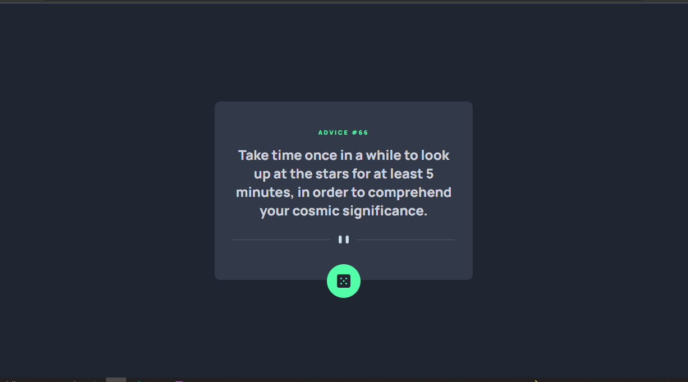
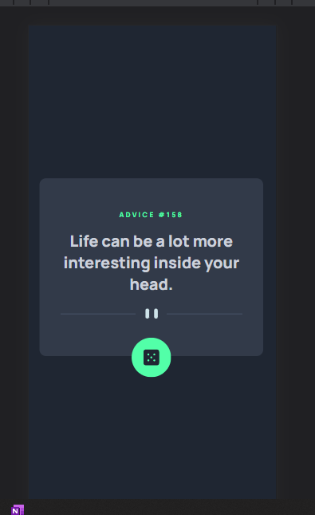

# Frontend Mentor - Advice generator app solution

This is a solution to the [Advice generator app challenge on Frontend Mentor](https://www.frontendmentor.io/challenges/advice-generator-app-QdUG-13db). Frontend Mentor challenges help you improve your coding skills by building realistic projects.

## Table of contents

  - [The challenge](#the-challenge)
  - [Screenshot](#screenshot)
  - [Links](#links)
- [My process](#my-process)
  - [Built with](#built-with)
  - [What I learned](#what-i-learned)
  - [Continued development](#continued-development)
- [Author](#author)


### The challenge

Users should be able to:

- View the optimal layout for the app depending on their device's screen size
- See hover states for all interactive elements on the page
- Generate a new piece of advice by clicking the dice icon

### Screenshot





### Links

- Solution URL: [solution](https://github.com/mbilal-x/frontendmentor_P5_advice-generator-app-main)
- Live Site URL: [live site](https://mbilal-x.github.io/frontendmentor_P5_advice-generator-app-main/)

## My process

### Built with

- Semantic HTML5 markup
- CSS custom properties
- Flexbox
- CSS Grid
- Mobile-first workflow
- js 


### What I learned
I learned the use of async functions and await keyword.
Used fetch() to get JSON data from API.


favorite code snippet:
```js
const loadAdvice = async () => {   
        try{
            const res =  await fetch(baseURL);
            const data = await res.json();
            
            advice_children[0].innerText = `advice #${data.slip.id}`;
            advice_children[1].innerText = data.slip.advice;
            // console.log(data.slip.id);
            // console.log(data.slip.advice);
        }catch(e){
            console.log('Error loading advice: ', e);
        }
    };
loadAdvice();
```

### Continued development
I still don't feel like i have completely grasped the async function and requesting concepts and need more practice and time with it.

- I will make a few more API requesting projects
- Next time I will also use Axios [A library for making HTTP requests]

## Author

- Website - [Muhammad Bilal](mohammadbilal.me)
- Frontend Mentor - [@mbilal-x](https://www.frontendmentor.io/profile/mbilal-x)
